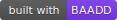

[](https://github.com/dweng0/Pyken/actions/workflows/evolve.yml)
[](https://github.com/dweng0/BAADD)

# Pyken

A token stream transformer. Pyken takes a JSON token stream — from [PyLex](https://github.com/dweng0/PyLex) or any compatible tokenizer — and remaps tokens according to a YAML mapping file, enabling token-level transpilation between languages or dialects.

### Features

- **Language-agnostic** — works with any `[{"type": "...", "value": "..."}]` JSON token stream
- **YAML-configured mappings** — define remapping rules without touching code
- **Two output modes** — reconstructed source text or a new JSON token stream
- **Pipeline-friendly** — designed to chain with PyLex and other tools
- **Strict mode** — fail fast if any token has no mapping rule
- **Bundled mappings** — Python → JavaScript, JavaScript → TypeScript, Python → Pseudocode

---

## Installation

```bash
git clone https://github.com/dweng0/Pyken.git
cd Pyken
pip install -r requirements.txt
```

---

## Usage

Pyken reads a JSON token stream from **stdin** (or `--input`) and writes transformed output to **stdout**.

### With PyLex

```bash
# Tokenise Python source, remap to JavaScript
python3 main.py hello.py lexers/python.yaml | python3 pyken.py mappings/python-to-javascript.yaml

# Tokenise Python source, remap to pseudocode
python3 main.py hello.py lexers/python.yaml | python3 pyken.py mappings/python-to-pseudocode.yaml
```

### From a token file

```bash
# Save tokens first
python3 main.py hello.py lexers/python.yaml > tokens.json

# Then remap
python3 pyken.py mappings/python-to-javascript.yaml --input tokens.json
```

### Output a new token stream instead of source text

```bash
python3 main.py foo.py lexers/python.yaml | python3 pyken.py mappings/python-to-javascript.yaml --tokens
```

This is useful for chaining multiple remapping steps:

```bash
python3 main.py foo.py lexers/python.yaml \
  | python3 pyken.py mappings/python-to-javascript.yaml --tokens \
  | python3 pyken.py mappings/javascript-to-typescript.yaml
```

### Strict mode

By default, tokens with no matching rule pass through unchanged with a warning on stderr. Use `--strict` to treat unmapped tokens as errors:

```bash
python3 main.py foo.py lexers/python.yaml | python3 pyken.py mappings/my-mapping.yaml --strict
```

---

## Example

**Input (Python):**
```python
def greet(name):
    if name:
        print("Hello " + name)
    return True
```

**After remapping with `python-to-javascript.yaml`:**
```javascript
function greet(name):
    if name:
        console.log("Hello " + name)
    return true
```

**After remapping with `python-to-pseudocode.yaml`:**
```
FUNCTION greet(name):
    IF name:
        OUTPUT("Hello " + name)
    RETURN YES
```

---

## Bundled Mappings

| File | From | To | What it does |
|------|------|----|--------------|
| `python-to-javascript.yaml` | Python | JavaScript | Remaps keywords: `def`→`function`, `elif`→`else if`, `True`→`true`, `None`→`null`, `print`→`console.log`, etc. |
| `javascript-to-typescript.yaml` | JavaScript | TypeScript | Remaps `var`→`let`, passes everything else through |
| `python-to-pseudocode.yaml` | Python | Pseudocode | Replaces keywords with plain English: `def`→`FUNCTION`, `if`→`IF`, `return`→`RETURN`, etc. |

---

## Writing Your Own Mapping

A mapping file is a YAML file with a list of rules. Each rule has a `match` block and an `emit` block.

```yaml
from: python
to: javascript
rules:
  # Match by type AND value (specific)
  - match:
      type: keyword
      value: "def"
    emit:
      value: "function"

  # Match by type only (general — catches anything not matched above)
  - match:
      type: keyword
    emit: pass

  # Pass whitespace and identifiers through unchanged
  - match:
      type: whitespace
    emit: pass
  - match:
      type: identifier
    emit: pass
```

**Rule matching:**
- Specific rules (type + value) are always tried before general rules (type only)
- `emit: pass` passes the token through unchanged
- Omitting `value` in `emit` keeps the original value
- Omitting `type` in `emit` keeps the original type

---

### Emit modes

#### `emit: pass` — keep the token unchanged

```yaml
- match:
    type: identifier
  emit: pass
```

#### `emit: discard` — remove the token entirely

Use this to drop tokens that have no equivalent in the target language.

```yaml
# Remove Python's trailing colon from block statements
- match:
    type: punctuation
    value: ":"
  emit: discard
```

The token is silently removed from the output. No warning is printed.

#### Replace value and/or type

```yaml
- match:
    type: keyword
    value: "def"
  emit:
    value: "function"       # replace value, keep type

- match:
    type: keyword
    value: "True"
  emit:
    type: boolean           # replace type, keep value

- match:
    type: keyword
    value: "None"
  emit:
    type: keyword
    value: "null"           # replace both
```

#### `emit: tokens` — expand one token into many

Use this when a single source token maps to multiple target tokens. The matched token is replaced by the full list.

```yaml
# Python INDENT becomes "{\n" in JavaScript
- match:
    type: indent
  emit:
    tokens:
      - type: punctuation
        value: " {"
      - type: newline
        value: "\n"

# Python DEDENT becomes a closing brace
- match:
    type: dedent
  emit:
    tokens:
      - type: punctuation
        value: "}"
      - type: newline
        value: "\n"
```

---

### Context-aware matching

#### `preceded_by` — lookbehind

Add `preceded_by` to a rule to match a token only when a specific token immediately precedes it.

```yaml
# Remove ":" only when it closes a block header (preceded by ")")
# Leaves ":" in dict literals alone
- match:
    type: punctuation
    value: ":"
    preceded_by:
      type: punctuation
      value: ")"
  emit: discard

# All other ":" (e.g. in dicts) pass through unchanged
- match:
    type: punctuation
    value: ":"
  emit: pass
```

#### `followed_by` — lookahead

Add `followed_by` to match a token only when a specific token immediately follows it. Useful for disambiguating structural tokens such as `{` used as a block opener vs `{` used to open an object literal.

```yaml
# Rust/JS "{" that opens a block (followed by newline) → discard it,
# let INDENT/DEDENT handling generate the Python-style indentation
- match:
    type: punctuator
    value: "{"
    followed_by:
      type: newline
  emit: discard

# "{" not followed by newline (object literal) → pass through unchanged
- match:
    type: punctuator
    value: "{"
  emit: pass
```

`preceded_by` and `followed_by` can be combined in a single rule:

```yaml
- match:
    type: punctuation
    value: ","
    preceded_by:
      type: identifier
    followed_by:
      type: whitespace
  emit: pass
```

---

### Sequence matching

Use `match: sequence` to match a run of consecutive tokens as a single pattern. This is necessary for multi-token constructs that have a single-token equivalent in the target language — for example `not in` (three tokens) → a single operator, or `: i32` (a Rust type annotation) → discard both tokens at once.

The sequence must list every token in order. Use `type` and/or `value` per token; omit either to match any value/type for that position.

```yaml
# Python "not in" (three tokens) → single operator token
- match:
    sequence:
      - type: keyword
        value: "not"
      - type: whitespace
      - type: keyword
        value: "in"
  emit:
    type: operator
    value: "not in"

# Rust type annotation ": i32" → discard both tokens
- match:
    sequence:
      - type: punctuation
        value: ":"
      - type: identifier          # matches any type name
  emit: discard

# Rust "let mut" → discard both (Python just assigns directly)
- match:
    sequence:
      - type: keyword
        value: "let"
      - type: whitespace
      - type: keyword
        value: "mut"
  emit: discard
```

A sequence rule consumes all matched tokens and produces the emitted output once. All `emit` modes work with sequence rules: `pass` (emits the first token unchanged), `discard`, value/type replace, `tokens: [...]`, and injection.

---

### Token injection

Use `emit: before` or `emit: after` to inject new tokens adjacent to the matched token **without replacing it**. This is how you add target-language constructs that have no source equivalent — for instance, adding TypeScript type annotations to parameters, or prepending a C++ return type before a function name.

`pass_through: true` keeps the matched token in the output. Omitting it, or setting it to `false`, replaces the matched token (same as the standard emit).

```yaml
# JavaScript → TypeScript: inject ": any" after each function parameter
# The parameter identifier is kept; the annotation is added after it
- match:
    type: identifier
    preceded_by:
      type: punctuator
      value: "("
  emit:
    pass_through: true
    after:
      - type: punctuator
        value: ":"
      - type: whitespace
        value: " "
      - type: identifier
        value: "any"

# Python → C++: inject return type "int " before a function name
- match:
    type: identifier
    preceded_by:
      type: keyword
      value: "def"
  emit:
    pass_through: true
    before:
      - type: identifier
        value: "int"
      - type: whitespace
        value: " "
```

`before` and `after` can be used together in one rule. The output order is always: `before` tokens → matched token (if `pass_through: true`) → `after` tokens.

---

#### `pass_through: true` on a sequence rule

When `pass_through: true` is set on a sequence rule, all matched tokens are kept in the output and the `before`/`after` tokens are injected around them. Without it, the sequence is consumed and replaced.

```yaml
# Python → Rust: inject "let " before every "identifier =" assignment
# Keeps the identifier and "=" unchanged, just adds "let " in front
- match:
    sequence:
      - type: identifier
      - type: whitespace
      - { type: operator, value: "=" }
    followed_by:
      not: { type: operator, value: "=" }
  emit:
    pass_through: true
    before:
      - type: keyword
        value: "let "
```

`followed_by` on a sequence rule checks the token immediately after the **last** element of the sequence.

---

### Negative context matching

Add `not_followed_by` or `not_preceded_by` to exclude a rule when a specific token is adjacent. Essential for distinguishing tokens that are identical in isolation but mean different things in context — for example `=` assignment vs the first character of `==`.

```yaml
# Match "=" as assignment only — not when followed by another "="
- match:
    type: operator
    value: "="
    not_followed_by:
      type: operator
      value: "="
  emit:
    pass_through: true
    before:
      - type: keyword
        value: "let "

# Match standalone "->" return type arrow, not inside a string
- match:
    type: operator
    value: "->"
    not_preceded_by:
      type: string_literal
  emit:
    value: ":"
```

`not_preceded_by` and `not_followed_by` can be combined with each other and with `preceded_by` / `followed_by` in the same rule.

---

### Value transforms in emit

By default `emit: value: "something"` replaces the token's value with a hardcoded string. Two additional forms let you derive the emitted value from the original token.

#### `{{value}}` — interpolate the matched token's value

Use `{{value}}` anywhere in the emit value string to insert the original token's value. For sequence rules, use `{{tokens[N].value}}` to reference the Nth token in the matched sequence (zero-indexed).

```yaml
# Python → C: "import os" → "#include <os.h>"
# tokens[0]=import  tokens[1]=whitespace  tokens[2]=os
- match:
    sequence:
      - { type: keyword, value: "import" }
      - type: whitespace
      - type: identifier
  emit:
    type: preprocessor
    value: "#include <{{tokens[2].value}}.h>"

# Rust: qualify an identifier with its crate path
- match:
    type: identifier
    preceded_by: { type: keyword, value: "use" }
  emit:
    value: "crate::{{value}}"
```

#### `value_regex` — transform the value with a regex substitution

Use `value_regex` with `pattern` and `replacement` to apply a regex substitution to the token's original value. If the pattern does not match, the value is passed through unchanged.

```yaml
# Python single-quoted strings → C double-quoted strings: 'hello' → "hello"
- match:
    type: string_literal
  emit:
    value_regex:
      pattern: "^'(.*)'$"
      replacement: '"\\1"'

# Python comments → C++ line comments: "# text" → "// text"
- match:
    type: comment
  emit:
    value_regex:
      pattern: "^#"
      replacement: "//"
```

---

### Rule priority (complete)

Rules are tried in this order — the first match wins:

| Priority | Rule type | When it applies |
|---|---|---|
| 1 | Sequence rule | `match: sequence: [...]` — matches multiple tokens |
| 2 | Context-aware + specific | type + value + any of `preceded_by`, `followed_by`, `not_preceded_by`, `not_followed_by` |
| 3 | Context-aware + general | type only + any context condition |
| 4 | Specific | type + value |
| 5 | General | type only |

---

## Running Tests

```bash
python3 -m pytest tests/ -v
```

---

## How It Works

Pyken is intentionally minimal. The core pipeline is:

1. Read a `[{"type": "...", "value": "..."}]` JSON array from stdin or a file
2. For each position in the stream, find the best matching rule (sequence rules first, then context-aware, then specific, then general)
3. Apply the `emit` transformation — replace, discard, expand to many tokens, or inject before/after
4. Output either the reconstructed source text (join all values) or a new JSON token stream

Because Pyken only cares about the `{type, value}` contract, it works with PyLex or any other tokenizer that produces compatible output.

---

## Project Roadmap

| Stage | Description | Status |
|-------|-------------|--------|
| Token-level remapping | Remap keyword values and types via YAML | Done |
| Bundled language mappings | Python→JS, JS→TS, Python→Pseudocode | Done |
| Pipeline chaining | `--tokens` output for multi-step transforms | Done |
| Discard tokens | `emit: discard` to drop tokens with no target equivalent | In progress |
| Multi-token emission | One source token expands to multiple target tokens | In progress |
| Context-aware matching | `preceded_by` / `followed_by` to disambiguate by context | In progress |
| Sequence matching | Match N consecutive tokens as a pattern, emit as one | In progress |
| Token injection | `emit: before` / `emit: after` to add tokens without removing the original | In progress |
| Negative context matching | `not_preceded_by` / `not_followed_by` to exclude rules by adjacent token | In progress |
| Value transforms | `{{value}}` interpolation and `value_regex` substitution in emit | In progress |
| Custom output language | Define a new language target from scratch | Planned |

---

## Contributing

Contributions are welcome — especially new mapping files for language pairs not yet covered.

Fork the repo, add your mapping under `mappings/`, and open a pull request.

---

## License

MIT
